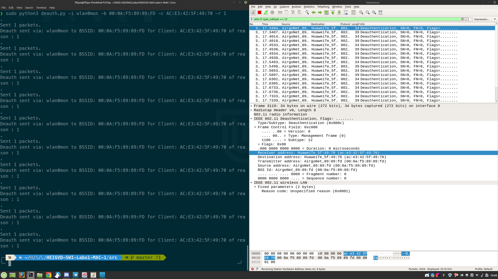
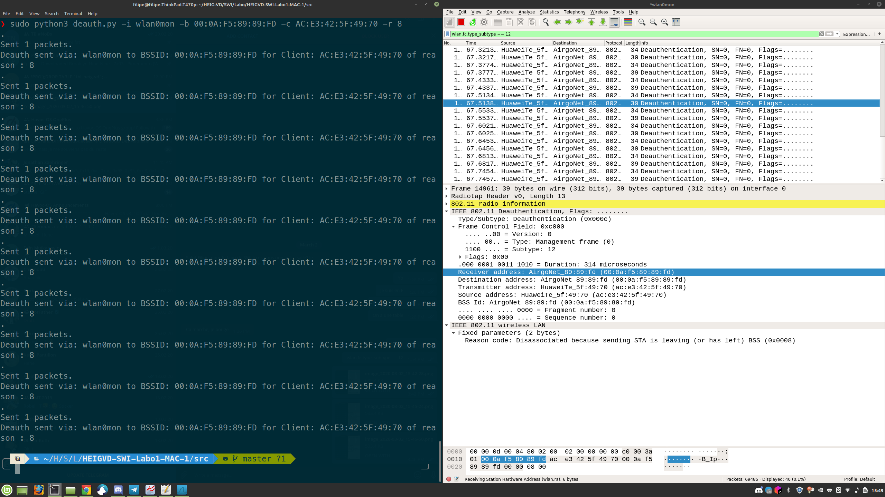
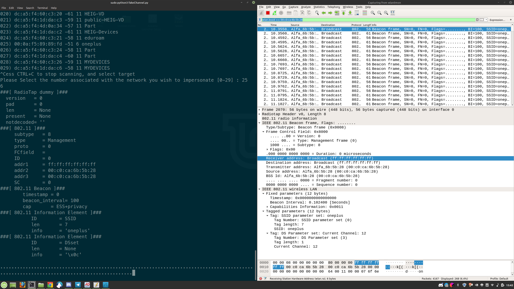
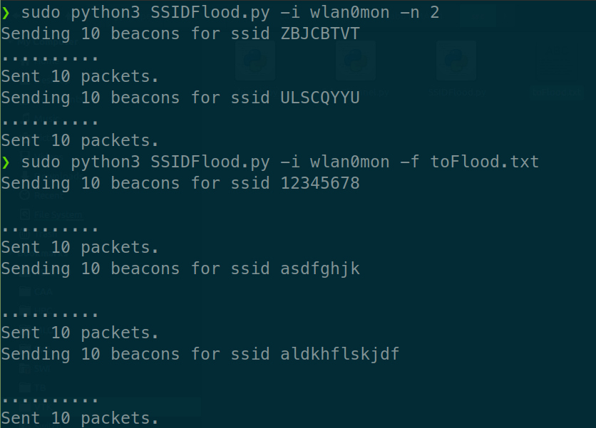

[Livrables](#livrables)

[Échéance](#échéance)

[Quelques pistes importantes](#quelques-pistes-utiles-avant-de-commencer-)

[Travail à réaliser](#travail-à-réaliser)

1. [Deauthentication attack](#1-deauthentication-attack)
2. [Fake channel evil tween attack](#2-fake-channel-evil-tween-attack)
3. [SSID Flood attack](#3-ssid-flood-attack)

# Sécurité des réseaux sans fil

## Laboratoire 802.11 MAC 1

__A faire en équipes de deux personnes__

### Pour cette partie pratique, vous devez être capable de :

*	Détecter si un certain client WiFi se trouve à proximité
*	Obtenir une liste des SSIDs annoncés par les clients WiFi présents

Vous allez devoir faire des recherches sur internet pour apprendre à utiliser Scapy et la suite aircrack pour vos manipulations. __Il est fortement conseillé d'employer une distribution Kali__ (on ne pourra pas assurer le support avec d'autres distributions). __Si vous utilisez une VM, il vous faudra une interface WiFi usb, disponible sur demande__.

__ATTENTION :__ Pour vos manipulations, il pourrait être important de bien fixer le canal lors de vos captures et/ou vos injections (à vous de déterminer si ceci est nécessaire pour les manipulations suivantes ou pas). Si vous en avez besoin, la méthode la plus sure est d'utiliser l'option :

```--channel``` de ```airodump-ng```

et de garder la fenêtre d'airodump ouverte en permanence pendant que vos scripts tournent ou vos manipulations sont effectuées.


## Quelques pistes utiles avant de commencer :

- Si vous devez capturer et injecter du trafic, il faudra configurer votre interface 802.11 en mode monitor.
- Python a un mode interactif très utile pour le développement. Il suffit de l'invoquer avec la commande ```python```. Ensuite, vous pouvez importer Scapy ou tout autre module nécessaire. En fait, vous pouvez même exécuter tout le script fourni en mode interactif !
- Scapy fonctionne aussi en mode interactif en invoquant la commande ```scapy```.  
- Dans le mode interactif, « nom de variable + <enter> » vous retourne le contenu de la variable.
- Pour visualiser en détail une trame avec Scapy en mode interactif, on utilise la fonction ```show()```. Par exemple, si vous chargez votre trame dans une variable nommée ```beacon```, vous pouvez visualiser tous ces champs et ses valeurs avec la commande ```beacon.show()```. Utilisez cette commande pour connaître les champs disponibles et les formats de chaque champ.

## Travail à réaliser

### 1. Deauthentication attack

Une STA ou un AP peuvent envoyer une trame de déauthentification pour mettre fin à une connexion.

Les trames de déauthentification sont des trames de management, donc de type 0, avec un sous-type 12 (0x0c). Voici le format de la trame de déauthentification :


Le corps de la trame (Frame body) contient, entre autres, un champ de deux octets appelé "Reason Code". Le but de ce champ est d'informer la raison de la déauthentification. Voici toutes les valeurs possibles pour le Reason Code :

| Code | Explication 802.11                                                                                                                                     |
|------|-------------------------------------------------------------------------------------------------------------------------------------------------------|
| 0    | Reserved                                                                                                                                              |
| 1    | Unspecified reason                                                                                                                                    |
| 2    | Previous authentication no longer valid                                                                                                               |
| 3    | station is leaving (or has left) IBSS or ESS                                                                                                          |
| 4    | Disassociated due to inactivity                                                                                                                       |
| 5    | Disassociated because AP is unable to handle all currently associated stations                                                                        |
| 6    | Class 2 frame received from nonauthenticated station                                                                                                  |
| 7    | Class 3 frame received from nonassociated station                                                                                                     |
| 8    | Disassociated because sending station is leaving (or has left) BSS                                                                                    |
| 9    | Station requesting (re)association is not authenticated with responding station                                                                       |
| 10   | Disassociated because the information in the Power Capability element is unacceptable                                                                 |
| 11   | Disassociated because the information in the Supported Channels element is unacceptable                                                               |
| 12   | Reserved                                                                                                                                              |
| 13   | Invalid information element, i.e., an information element defined in this standard for which the content does not meet the specifications in Clause 7 |
| 14   | Message integrity code (MIC) failure                                                                                                                                              |
| 15   | 4-Way Handshake timeout                                                                                                                                              |
| 16   | Group Key Handshake timeout                                                                                                                                              |
| 17   | Information element in 4-Way Handshake different from (Re)Association Request/Probe Response/Beacon frame                                                                                                                                              |
| 18   | Invalid group cipher                                                                                                                                              |
| 19   | Invalid pairwise cipher                                                                                                                                              |
| 20   | Invalid AKMP                                                                                                                                              |
| 21   | Unsupported RSN information element version                                                                                                                                              |
| 22   | Invalid RSN information element capabilities                                                                                                                                              |
| 23   | IEEE 802.1X authentication failed                                                                                                                                              |
| 24   | Cipher suite rejected because of the security policy                                                                                                                                              |
| 25-31 | Reserved                                                                                                                                              |
| 32 | Disassociated for unspecified, QoS-related reason                                                                                                                                              |
| 33 | Disassociated because QAP lacks sufficient bandwidth for this QSTA                                                                                                                                              |
| 34 | Disassociated because excessive number of frames need to be acknowledged, but are not acknowledged due to AP transmissions and/or poor channel conditions                                                                                                                                              |
| 35 | Disassociated because QSTA is transmitting outside the limits of its TXOPs                                                                                                                                              |
| 36 | Requested from peer QSTA as the QSTA is leaving the QBSS (or resetting)                                                                                                                                              |
| 37 | Requested from peer QSTA as it does not want to use the mechanism                                                                                                                                              |
| 38 | Requested from peer QSTA as the QSTA received frames using the mechanism for which a setup is required                                                                                                                                              |
| 39 | Requested from peer QSTA due to timeout                                                                                                                                              |
| 40 | Peer QSTA does not support the requested cipher suite                                                                                                                                              |
| 46-65535 | Reserved                                                                                                                                              |
 
a) Utiliser la fonction de déauthentification de la suite aircrack, capturer les échanges et identifier le Reason code et son interpretation.

__Question__ : quel code est utilisé par aircrack pour déauthentifier un client 802.11. Quelle est son interpretation ?

    Le reason code indiqué est le 7, soit "Class 3 frame received from nonassociated station". Ce reason code est indiqué si une STA cliente a tenté de transférer des données (> class 2) alors qu'elle n'était pas encore associée à l'AP.

__Question__ : A l'aide d'un filtre d'affichage, essayer de trouver d'autres trames de déauthentification dans votre capture. Avez-vous en trouvé d'autres ? Si oui, quel code contient-elle et quelle est son interpretation ?

    Avec ce filtre d'affichage : wlan.fc.type_subtype == 12, nous avons pu retrouver les trames que nous avons envoyées, mais même en changeant de channel, nous n'avons pas pu observer d'autres trames sur le réseau.

b) Développer un script en Python/Scapy capable de générer et envoyer des trames de déauthentification. Le script donne le choix entre des Reason codes différents (liste ci-après) et doit pouvoir déduire si le message doit être envoyé à la STA ou à l'AP :
* 1 - Unspecified
* 4 - Disassociated due to inactivity
* 5 - Disassociated because AP is unable to handle all currently associated stations
* 8 - Deauthenticated because sending STA is leaving BSS

Voici le script en cours avec deux codes de raison différents :





__Question__ : quels codes/raisons justifient l'envoi de la trame à la STA cible et pourquoi ?

    Le R.C. 1 (unspecified) indique qu'on ne sait pas quel est le problème, il peut donc être utilisé dans toutes sortes de situations.
    Le R.C. 4 (Disassociated due to inactivity) est lié à la déconnexion forcée par l'AP lorsque le client en question est trop longtemps inactif, il n'a donc que de sens lorsque l'AP envoie la trame à la STA.
    Le R.C. 5 (Disassociated because AP is unable to handle all currently associated stations) est dans le même esprit que le R.C. 4, soit l'AP se débarasse de la connexion avec la STA, car l'AP a trop de STA connectées.

__Question__ : quels codes/raisons justifient l'envoie de la trame à l'AP et pourquoi ?

    Le R.C. 1 (unspecified) indique qu'on ne sait pas quel est le problème, il peut donc être utilisé dans toutes sortes de situations.
    Le R.C. 8 (Deauthenticated because sending STA is leaving BSS) est lié à une STA quittant le BSS dans lequel elle était jusqu'alors, ce qui n'a donc de sens que venant de la STA quittant le BSS.

__Question__ : Comment essayer de déauthentifier toutes les STA ?

    On utilise comme addresse de cible client l'adresse FF:FF:FF:FF:FF:FF, ce qui déconnecte tous les clients connectés.

__Question__ : Quelle est la différence entre le code 3 et le code 8 de la liste ?

    3 : station is leaving (or has left) IBSS or ESS
    8 : deauthenticated because sending STA is leaving BSS

    Dans le cas d'un code 8 on se trouve dans le cadre Wifi classique d'un Basic Service Set avec un point d'accès (AP) et des stations clients associées à ce dernier.

    Le code 3 indique qu'on se trouve dans un autre cadre, soit un réseau wireless ad-hoc (IBSS) ne contenant pas d'AP ou un extended service set (ESS, plusieurs BSS paraissants comme unique au layer 2.)

    Dans les deux cas, une station sort du service set dont elle faisait partie jusqu'alors.

__Question__ : Expliquer l'effet de cette attaque sur la cible

    La cible est déconnectée de l'AP et perd temporairement la connectivité à internet. Elle se reconnecte directement à l'AP ou à un autre réseau disponible.

### 2. Fake channel evil twin attack
a)	Développer un script en Python/Scapy avec les fonctionnalités suivantes :

* Dresser une liste des SSID disponibles à proximité
* Présenter à l'utilisateur la liste, avec les numéros de canaux et les puissances
* Permettre à l'utilisateur de choisir le réseau à attaquer
* Générer un beacon concurrent annonçant un réseau sur un canal différent se trouvant à 6 canaux de séparation du réseau original



__Question__ : Expliquer l'effet de cette attaque sur la cible

    Le but est de créer un réseau qui semble équivalent à un autre afin de forcer ses utilisateurs à s'y connecter. Cela exploite le fait que sur beaucoup de devices les réseaux disponibles n'indiquent que des informations limitées (nom, nécessité d'un password, encryption).
    On peut alors simplement créer un accès point reflétant ces informations si on les a ou forcer les utilisateurs à s'y connecter via social engineering.
    L'attaque deauth vue précédemment pourrait également être utilisée pour déconnecter l'utilisateur d'un AP pour lequel on a créé un evil twin. L'utilisateur peu soucieux pourrait alors se sentir justifié à se connecter à notre AP frauduleux.

### 3. SSID flood attack

Développer un script en Python/Scapy capable d'inonder la salle avec des SSID dont le nom correspond à une liste contenue dans un fichier text fournit par un utilisateur. Si l'utilisateur ne possède pas une liste, il peut spécifier le nombre d'AP à générer. Dans ce cas, les SSID seront générés de manière aléatoire.

Pour ce script on suit la même logique au niveau du code que pour la génération des trames beacon pour l'evil twin attack. On doit simplement ajouter l'utilisation des SSIDs depuis un fichier et la génération aléatoire des SSID si ce fichier est absent.



## Livrables

Un fork du repo original . Puis, un Pull Request contenant :

- Script de Deauthentication de clients 802.11 __abondamment commenté/documenté__

- Script fake channel __abondamment commenté/documenté__

- Script SSID flood __abondamment commenté/documenté__

- Captures d'écran du fonctionnement de chaque script

-	Réponses aux éventuelles questions posées dans la donnée. Vous répondez aux questions dans votre ```README.md``` ou dans un pdf séparé

-	Envoyer le hash du commit et votre username GitHub par email au professeur et à l'assistant


## Échéance

Le 9 mars 2020 à 23h59
